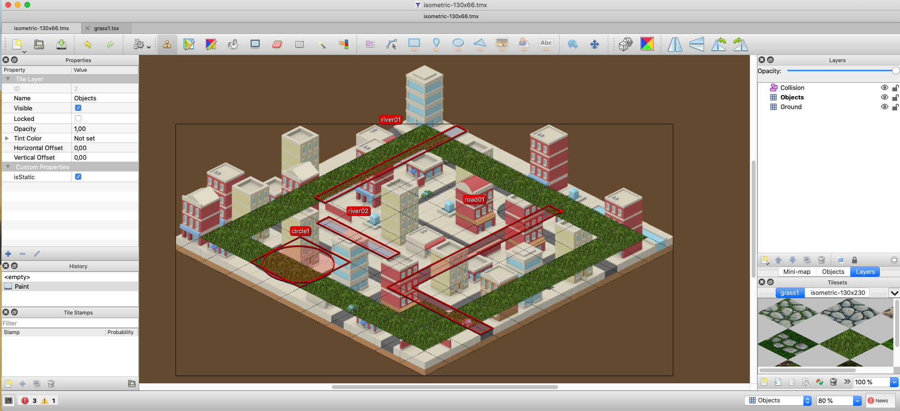
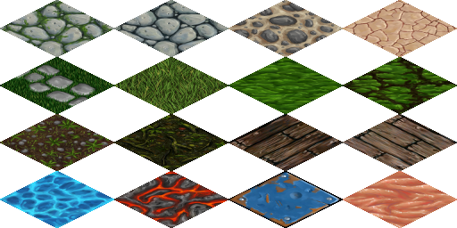
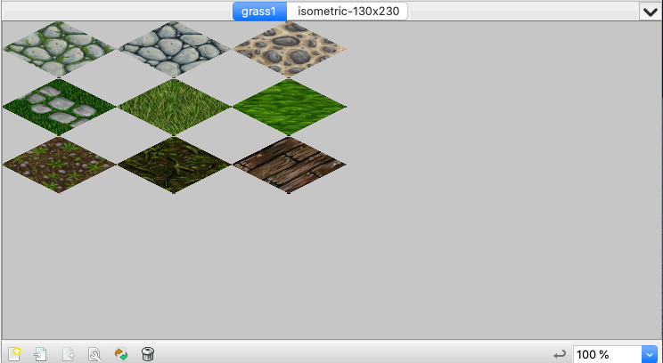
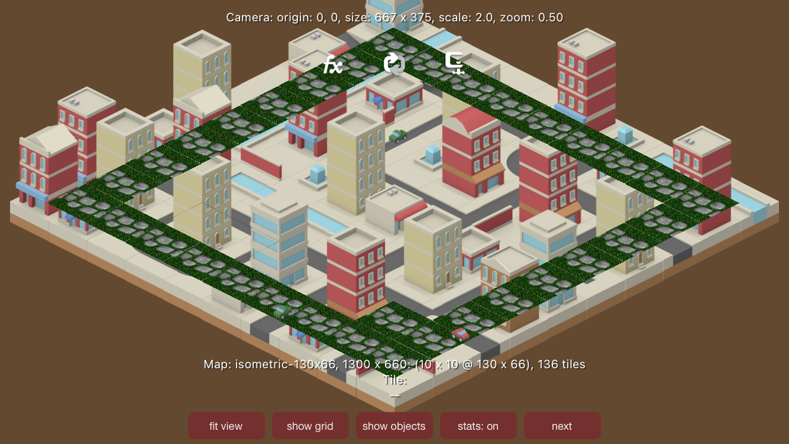

> SKTiled is a Swift framework for using [Tiled][tiled-url] assets with Apple's SpriteKit.


**SKTiledBugged**

This is the Tiled Map Editor version 1.4.2, I've try to reproduce the ID tile bug on **iOS** code:
 

Using grass1.txt:

```
<?xml version="1.0" encoding="UTF-8"?>
<tileset version="1.4" tiledversion="1.4.2" name="grass1" tilewidth="128" tileheight="64" margin="1" tilecount="9" columns="3">
 <image source="handpainted.png" width="512" height="256"/>
</tileset>
```
that use this tileset image:

 

This image below showed how editor load this tsx:

 

And finally this image below showed how the demo app in the simulator builds this map:

 

So, insted of using the TILE ID number 4 (the grass) the app use the TILE ID number 3 (the grass with stones).

